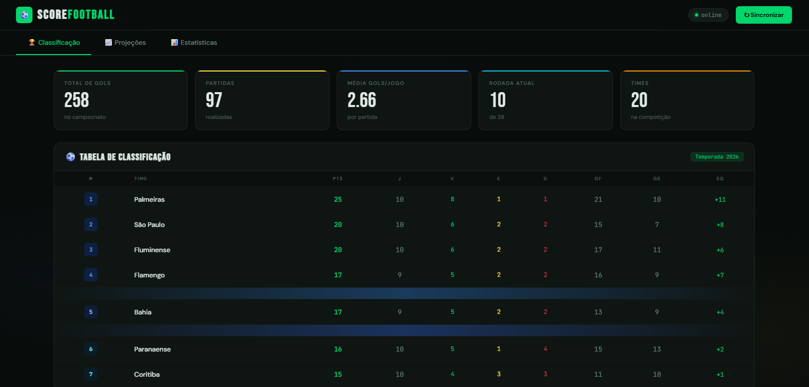
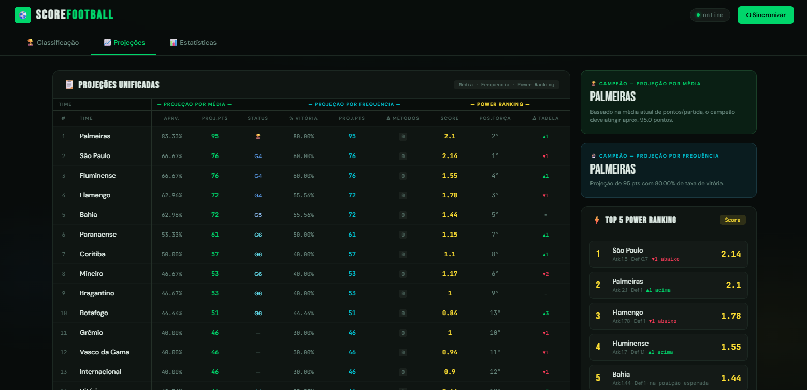

# ⚽ ScoreFootball 
### Versão 1.15.0 - Abril de 2026

Plataforma de análise e previsão do Brasileirão baseada em dados reais.

Simula cenários do campeonato utilizando modelos estatísticos como **Poisson** e **Monte Carlo** para estimar:

* 🏆 Probabilidade de título
* 📈 Chances de G4 / Libertadores
* ⚠️ Risco de rebaixamento

---

## 🖥️ Interface

### Tela de Classificação


### Tela de Projeções


---

## ⚡ Exemplo real de saída

```json
{
  "time": "Palmeiras",
  "chance_titulo_%": 72.5,
  "chance_g4_%": 95.2,
  "chance_rebaixamento_%": 0.1
}
```

👉 A API transforma dados brutos em probabilidades acionáveis.

---

## 📚 Documentação rápida
* 📄Acesse a documentação online: https://mageskylms.github.io/scoreFootball/
* 📄 Endpoints: [`/docs/endpoints.md`](./docs/endpoints.md)
* 🔍 Swagger: http://localhost:8000/docs

---

## 🚀 Tecnologias Utilizadas

O projeto foi construído em arquitetura de **Monorepo**, dividindo claramente as responsabilidades entre Backend e Frontend, tudo orquestrado via containers.

**Backend:**
- **[FastAPI](https://fastapi.tiangolo.com/):** Framework web de altíssima performance para a construção da API.
- **[PostgreSQL](https://www.postgresql.org/):** Banco de dados relacional robusto.
- **[SQLAlchemy & Pydantic]:** ORM para modelagem de dados e tipagem rigorosa/validação de schemas.
- **[NumPy]:** Motor matemático para os cálculos das simulações de probabilidade.

**Frontend:**
- **HTML5, CSS3 & Vanilla JavaScript:** Interface leve, rápida e sem dependência de frameworks pesados.
- **[Nginx](https://www.nginx.com/):** Servidor web de alta performance usado para servir os arquivos estáticos.

**Infraestrutura:**
- **[Docker & Docker Compose](https://www.docker.com/):** Padronização do ambiente de desenvolvimento e deploy.

## 🤖 Sobre o Frontend

O frontend foi desenvolvido com apoio de ferramentas de IA para acelerar a prototipação e refinamento visual.

A arquitetura, integração com a API e evolução do sistema são controladas manualmente.

---

## ⚙️ Como Executar o Projeto Localmente

O projeto foi inteiramente "dockerizado" para que você possa rodá-lo com poucos comandos, sem precisar instalar Python, Node ou PostgreSQL diretamente na sua máquina.

### 1. Pré-requisitos
- Ter o [Docker](https://docs.docker.com/get-docker/) e o [Docker Compose](https://docs.docker.com/compose/install/) instalados.

### 2. Configuração do Ambiente (.env)
Crie um arquivo chamado `.env` na raiz do projeto (mesmo local do `docker-compose.yml`) e adicione as variáveis de ambiente necessárias. Você vai precisar de uma chave gratuita da API do football-data.org.

```env
# .env
API_KEY=sua_chave_da_api_aqui
```

### 3. Subindo os Containers
No terminal, na raiz do projeto, execute o comando abaixo para construir as imagens e subir os três serviços (Banco de Dados, Backend e Frontend):

```bash
docker-compose up -d --build
```

### 4. Acessando a Aplicação
- **Interface de Usuário (Frontend):** http://localhost:3000
- **Documentação Interativa da API (Swagger):** http://localhost:8000/docs

*Nota: Ao acessar o sistema pela primeira vez, lembre-se de clicar em "Sincronizar" na interface (ou bater na rota `/brasileirao/sync/dados`) para preencher o seu banco de dados local com os dados da temporada atual.*

---

## 📂 Estrutura do Projeto

```text
scoreFootball/
├── docker-compose.yml       # Orquestração dos serviços (DB, API, Nginx)
├── .env                     # Variáveis sensíveis (ignoradas no git)
├── backend/                 # API REST em FastAPI
│   ├── main.py              # Ponto de entrada e configuração do CORS
│   ├── routes.py            # Controladores e Endpoints HTTP
│   ├── service.py           # Regras de negócio, Poisson e Monte Carlo
│   ├── models.py            # Tabelas do banco de dados (SQLAlchemy)
│   ├── schemas.py           # Validações de entrada/saída (Pydantic)
│   └── Dockerfile           # Imagem Docker do Python
└── frontend/                # SPA Vanilla JS
    ├── index.html           # Estrutura visual e abas
    ├── style.css            # Estilização
    └── script.js            # Consumo da API e renderização do DOM
└── docs/                    # Documentação da API
    └── endpoints.md         # Descrição de cada rota da API
```

---

## 🧠 Modelos Preditivos

A API utiliza diferentes abordagens estatísticas para projetar o desempenho das equipes ao longo do campeonato.

### 📈 Tendência (Média e Frequência)

Projeção baseada no desempenho atual das equipes:

* Média de pontos por jogo
* Frequência de vitórias, empates e derrotas

---

### ⚡ Power Ranking

Avalia a força relativa dos times com base em:

* Eficiência ofensiva (gols marcados)
* Consistência defensiva (gols sofridos)

Permite identificar equipes que estão performando acima ou abaixo do esperado.

---

### 🎲 Simulação (Poisson + Monte Carlo)

As partidas futuras são simuladas utilizando:

* **Distribuição de Poisson** → modela a quantidade de gols esperados por time
* **Monte Carlo** → executa múltiplos cenários do campeonato

Isso permite calcular probabilidades reais como:

* Chance de título
* Classificação para competições internacionais
* Risco de rebaixamento

---

> ⚠️ **Limitação atual:** os cálculos utilizam apenas dados da temporada atual, sem considerar histórico de anos anteriores.

---

## 📄 Licença

**Copyright © 2024 ScoreFootball. Todos os direitos reservados.**

O código-fonte deste projeto é disponibilizado apenas para **uso pessoal** e **estudo educacional**. 

É **estritamente proibido** modificar, criar trabalhos derivados, distribuir, sublicenciar, comercializar ou utilizar este software (ou partes dele) em outros projetos sem a permissão expressa e por escrito do autor.